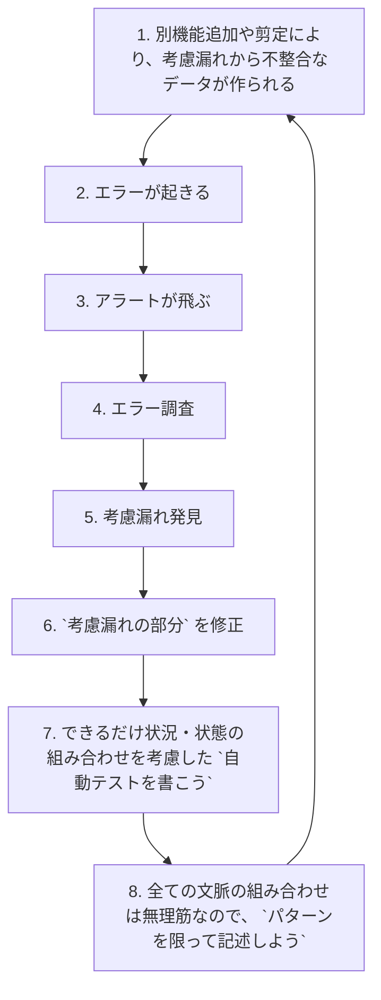

# なぜ不整合な状況・状態を作成不可能にするのか

## 答え

| idx | 理由                                                            |
|:---:|:--------------------------------------------------------------|
|  1  | 不整合な状況・状態への考慮不足が起きうる状況が減ると考えているから                             |
|  2  | 不整合な状況・状態は作成不可能なので、その状態・状況のテストはできないから(「記述できるが、記述しない」という場合が多い) |

## ありがちだけど避けたい流れ

## 伝えたいこと

:::danger ありがちだけど避けたいこと
- 修正されるのは考慮漏れの部分 `のみ`
- 修正によって、不整合な状況・状態を `作らない` ようにしている
  - 確認するのは `人間の目` や `自動テスト`
:::

:::tip 目指したいこと
- 不整合な状況・状態(データ)が `考慮不足が起きうる状況` を減らそう
- 不整合な状況・状態(データ)を `作れない` ようにしよう
  - そもそも確認を不要にしよう
:::

:::caution こういうことではない
- `全ての組み合わせテストを書こう`ではない
- `考慮不足を減らそう` ではない
:::

#### 蛇足

- 目指したいことを実現するには、どういうパターンがあって、どういうパターンは `ない` のか、しっかりとした分析をする必要がある
- 不整合な状況・状態を `作れない` → アプリのバグを 0 にできるというわけではない
  - 不整合な状況・状態同士の組み合わせで不整合はありえたりする
    - これをまた1つのデータ構造でラップしてありえないようにすることは可能かもしれないが、 0 にするレベルまでだと多分辛い
- 人間が考慮しなくても、コンパイラが考慮してくれる世界でプログラミングしたい
- レビューでもレビュアーが考慮することも減らせる
- OKのコードでも、まだ不整合なデータは作ることができる
  - 空のListを持つバリデーションエラー
    - `NotEmptyList<String>` 的なデータ構造が標準で欲しくなる